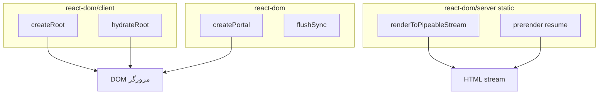

# React DOM APIs — مرجع `react-dom`

> 🧭 پیش‌نیاز: [React APIs](./React-APIs.md) · بعدی: [Best Practices](./Best-Practices.md)

نقشهٔ APIهای پکیج `react-dom` و `react-dom/client` — اتصال React به DOM و رندر سمت سرور.

---

## 📖 مفهوم

پکیج `react-dom` پل بین درخت React و DOM مرورگر است: mount اولیه، `hydrate`، `Portal`، و در برخی موارد flush همزمان. APIهای **سرور** (`react-dom/server`، `react-dom/static`) خروجی HTML/stream تولید می‌کنند — جدا از منطق کامپوننت در `react`.

این فایل راهنمای سریع است؛ جزئیات در [react.dev/reference/react-dom](https://react.dev/reference/react-dom).

---

## چرا این ویژگی وجود دارد؟

بسیاری از باگ‌ها از قاطی کردن `react` و `react-dom` ناشی می‌شود — مثلاً `createRoot` را از پکیج اشتباه import کردن، یا `render` قدیمی React 17 را در پروژهٔ 18 نگه داشتن.

---

## چه مشکلی را حل می‌کند؟

- انتخاب API درست برای SPA (`createRoot`) در برابر SSR (`hydrateRoot`)
- فهم تفاوت Client-only (`createPortal`) و Server streaming
- مهاجرت از `ReactDOM.render` (منسوخ) به API جدید

---

## ⚙️ نحوه کار — نقشه APIها

### ۱. Client — `react-dom/client`

| API | کاربرد | فایل در مخزن |
|-----|--------|--------------|
| `createRoot(domNode)` | mount اپ React 18+ | [Installation](./Installation.md)، [Quick-Start](./Quick-Start.md) |
| `root.render(element)` | رندر/به‌روزرسانی درخت | [Rendering](./Rendering.md) |
| `root.unmount()` | پاک‌سازی کامل | [Lifecycle](./Lifecycle.md) |
| `hydrateRoot(domNode, element)` | attach به HTML از SSR | [Escape-Hatches/Server-Components](./Escape-Hatches/Server-Components.md) |

**الگوی رایج (Vite / CRA):**

```jsx
// src/main.jsx
import { createRoot } from "react-dom/client";
import App from "./App";

createRoot(document.getElementById("root")).render(<App />);
```

### ۲. Portal — `react-dom`

| API | کاربرد | فایل در مخزن |
|-----|--------|--------------|
| `createPortal(children, domNode)` | رندر فرزند در جای دیگر DOM | [Portals](./Portals.md) |

برای مودال، tooltip و منوی شناور — بدون شکستن سلسله‌مراتب React برای event bubbling.

### ۳. Flush همزمان — `react-dom`

| API | کاربرد | فایل در مخزن |
|-----|--------|--------------|
| `flushSync(callback)` | اجرای فوری به‌روزرسانی (خارج از Transition) | [Concurrent-Features](./Escape-Hatches/Concurrent-Features.md) |

فقط وقتی DOM **بلافاصله** بعد از `setState` لازم است (مثلاً اندازه‌گیری layout) — نه برای هر به‌روزرسانی.

### ۴. Server — `react-dom/server` و `react-dom/static`

| API | کاربرد | توجه |
|-----|--------|------|
| `renderToString` | HTML یک‌تکه (قدیمی‌تر) | streaming ترجیح داده می‌شود |
| `renderToPipeableStream` | stream HTML به Node | SSR کلاسیک |
| `prerender` / `resume` | کنترل پیشرفته stream (React 19+) | [Nextjs/Streaming-And-Suspense](./Nextjs/Streaming-And-Suspense.md) |

در **Next.js App Router** معمولاً مستقیماً این APIها را صدا نمی‌زنید — فریم‌ورک خودش RSC و streaming را مدیریت می‌کند — [Nextjs/README](./Nextjs/README.md).

### ۵. منسوخ — React 17 و قبل

| API | وضعیت | جایگزین |
|-----|--------|---------|
| `ReactDOM.render` | منسوخ | `createRoot` |
| `ReactDOM.hydrate` | منسوخ | `hydrateRoot` |
| `unmountComponentAtNode` | منسوخ | `root.unmount()` |

جزئیات: [Migration-Notes](./Migration-Notes.md).

---

## تفاوت Client / Server / Static



---

## مثال واقعی در پروژه

در fast-react-pizza، `createRoot` در `main.jsx` اپ را mount می‌کند؛ مودال سفارش با `createPortal` روی `document.body` رندر می‌شود — [Portals](./Portals.md). در Next.js Wild Oasis، SSR/streaming توسط فریم‌ورک انجام می‌شود نه `renderToString` دستی.

---

## 🚀 Best Practices

✅ همیشه `createRoot` / `hydrateRoot` در React 18+  
✅ `Portal` برای UI لایه‌ای که از layout خارج است  
✅ `flushSync` کم‌مصرف — پیش‌فرض Concurrent را نشکنید  
✅ SSR/streaming را در Next.js به فریم‌ورک بسپارید  
✅ منطق کامپوننت در `react`؛ فقط mount در `react-dom`

---

## ⚠️ اشتباهات رایج

❌ `ReactDOM.render` در پروژهٔ جدید  
❌ `createPortal` بدون مدیریت focus/a11y برای مودال  
❌ `flushSync` برای هر `setState` — lag UI  
❌ قاطی کردن API Next.js با `react-dom/server` در App Router  
❌ import `createRoot` از `react-dom` به‌جای `react-dom/client`

---

## ارتباط با مفاهیم دیگر

- [React-APIs](./React-APIs.md) — پکیج `react`
- [Portals](./Portals.md) — `createPortal` عمیق
- [Rendering](./Rendering.md) — چرخه رندر
- [Escape-Hatches/Server-Components](./Escape-Hatches/Server-Components.md) — RSC و Flight
- [Nextjs/Streaming-And-Suspense](./Nextjs/Streaming-And-Suspense.md) — streaming در عمل
- [Migration-Notes](./Migration-Notes.md) — `render` → `createRoot`

---

## خلاصه

برای mount از `react-dom/client` استفاده می‌شود؛ `createPortal` برای UI خارج از والد؛ `flushSync` برای به‌روزرسانی فوری نادر؛ APIهای server برای HTML/stream. در Next.js لایهٔ سرور را فریم‌ورک مدیریت می‌کند.

---

## 📚 منابع

- [React DOM — react.dev](https://react.dev/reference/react-dom)
- [createRoot — react.dev](https://react.dev/reference/react-dom/client/createRoot)
- [hydrateRoot — react.dev](https://react.dev/reference/react-dom/client/hydrateRoot)
- [createPortal — react.dev](https://react.dev/reference/react-dom/createPortal)
- [flushSync — react.dev](https://react.dev/reference/react-dom/flushSync)
